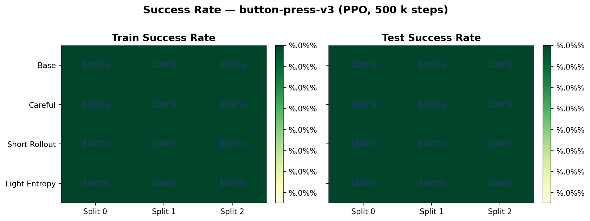
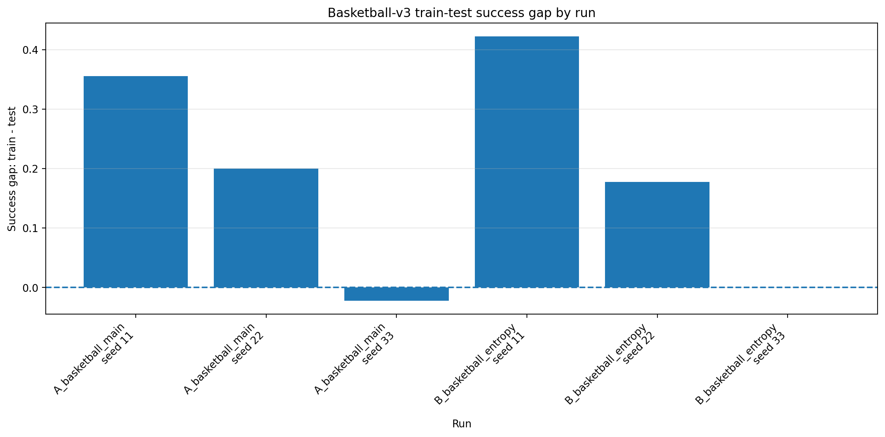
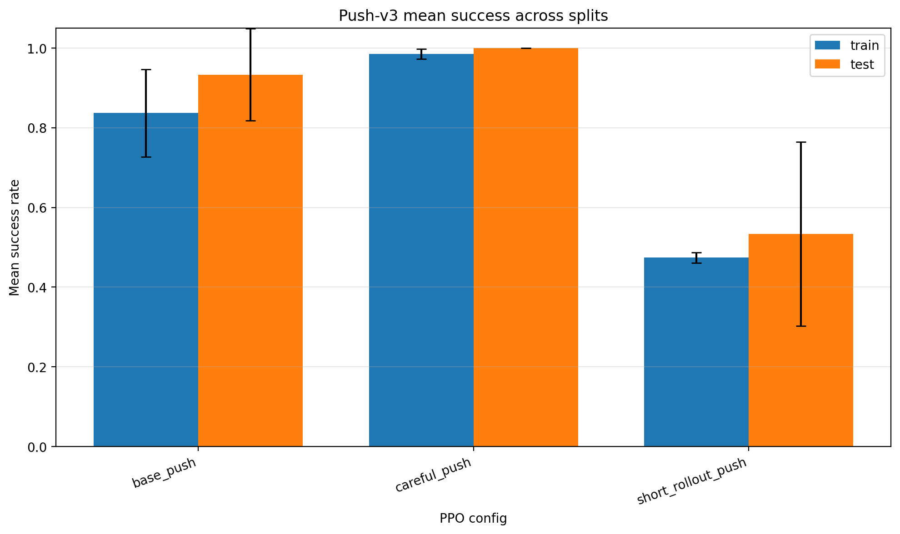
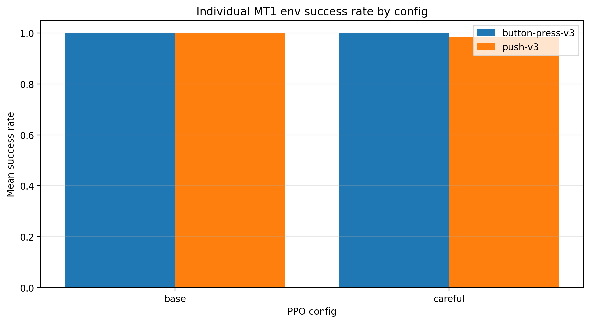
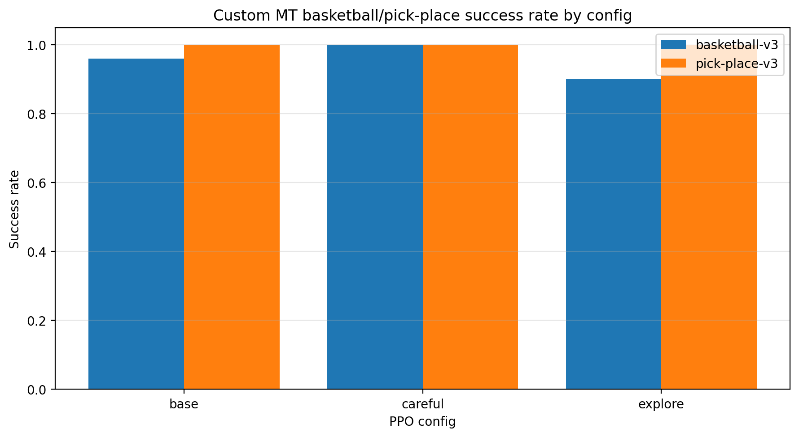
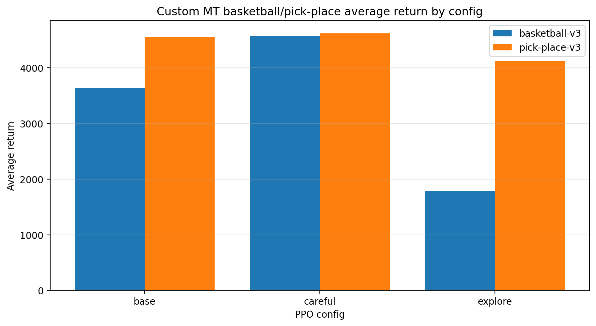
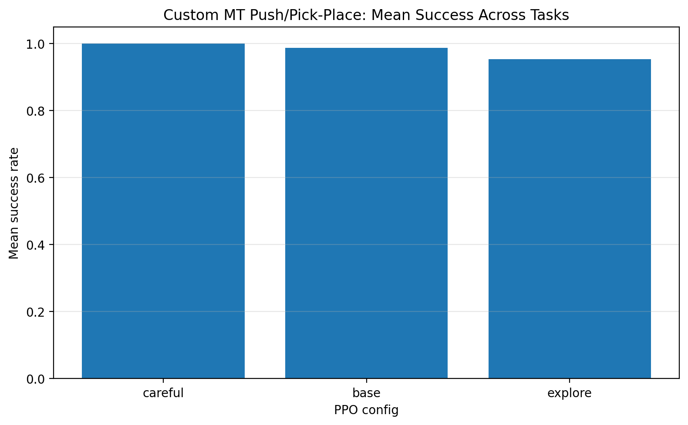
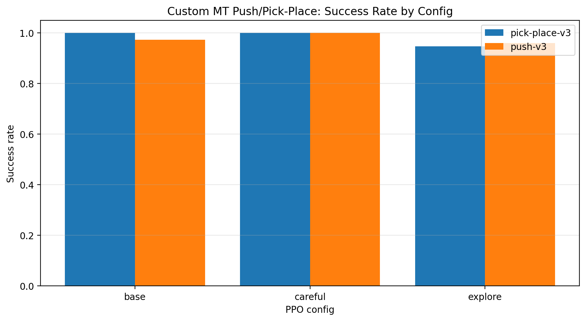
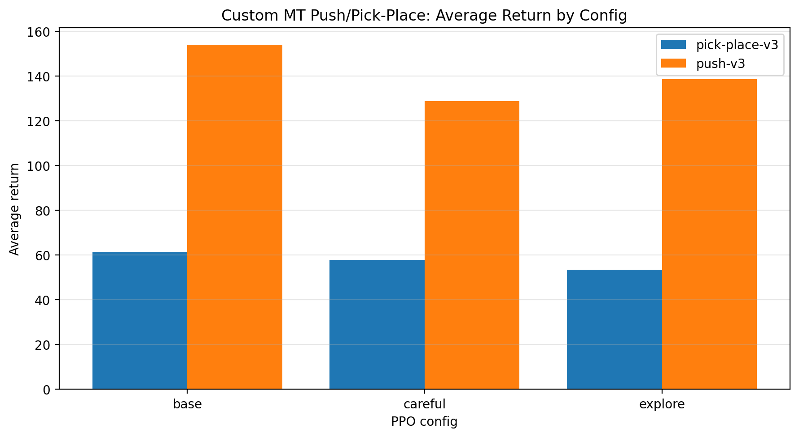

# Metaworld-Tests
# Meta-World PPO Results Summary

This file summarizes the main PPO evaluation results in this repository and links the corresponding figures/notebooks.

> Note: if GitHub fails to render a notebook, open it through **nbviewer** using the links below.

---

## Repository structure

The repository contains results for:

### Single-task PPO experiments

| Folder | Environment | Main result files |
|---|---|---|
| `button_press_v3/` | `button-press-v3` | notebook + figure |
| `basketball/` | `basketball-v3` | `ppo_basketball_results.csv` + figures |
| `push_v3/` | `push-v3` | aggregate/per-episode CSVs + figures |
| `pick-place/` | `pick-place-v3` | aggregate/per-episode CSVs + figures |

### Custom multi-task PPO experiments

| Folder | Tasks | Main result files |
|---|---|---|
| `custom_button_push/` | `button-press-v3` + `push-v3` | summary CSVs + figures |
| `custom_basketball_pick_place/` | `basketball-v3` + `pick-place-v3` | summary CSVs + figures |
| `custom_push_pickplace/` | `push-v3` + `pick-place-v3` | summary CSVs + figures |

---

## Notebook links

GitHub sometimes fails to render `.ipynb` files. Use nbviewer if needed:

- [Basketball results notebook](https://nbviewer.org/github/MikeMiaris/Metaworld-Tests/blob/main/basketball/basketball_results.ipynb)
- [Button-press results notebook](https://nbviewer.org/github/MikeMiaris/Metaworld-Tests/blob/main/button_press_v3/button_press_results.ipynb)
- [Push-v3 results notebook](https://nbviewer.org/github/MikeMiaris/Metaworld-Tests/blob/main/push_v3/push_v3_results_notebook.ipynb)
- [Pick-place results notebook](https://nbviewer.org/github/MikeMiaris/Metaworld-Tests/blob/main/pick-place/pick_place_results.ipynb)
- [Custom Button-Push results notebook](https://nbviewer.org/github/MikeMiaris/Metaworld-Tests/blob/main/custom_button_push/button_push_custom_mt_results.ipynb)
- [Custom Basketball-PickPlace results notebook](https://nbviewer.org/github/MikeMiaris/Metaworld-Tests/blob/main/custom_basketball_pick_place/basketball_pickplace_custom_mt_results_notebook.ipynb)
- [Custom Push-PickPlace results notebook](https://nbviewer.org/github/MikeMiaris/Metaworld-Tests/blob/main/custom_push_pickplace/push_pickplace_custom_mt_results_notebook.ipynb)

---

# 1. Single-task experiments

## 1.1 `button-press-v3`

The `button_press_v3` folder currently contains the notebook `button_press_results.ipynb`, the evaluation script, the training script, and the figure `fig1_success_rate_heatmap.png`.

The available notebook indicates that the experiment evaluated the following PPO configurations across checkpoints:

- `base_button`
- `careful_button`
- `light_entropy_button`
- `short_rollout_button`

The checkpoint evaluation uses:

- checkpoints: `100000`, `200000`, `300000`, `400000`, `500000`
- groups: `train`, `test`
- success rate, return, and first-success step as metrics

> The summary CSV referenced by the notebook is `button-press_v3_ppo_split_runs/results/checkpoint_eval/button_checkpoint_across_splits_summary.csv`, but this CSV is not currently visible in the root `button_press_v3/` folder. Therefore, the figure below is included, but the full numeric table should be committed if this result is going to be used as a main thesis result.

### Figure



---

## 1.2 `basketball-v3`

Source CSV:

```text
basketball/ppo_basketball_results.csv
```

Evaluation setup visible in the CSV:

- environment: `basketball-v3`
- total timesteps: `6,000,000`
- parallel envs: `4`
- train tasks: `45`
- test tasks: `5`
- split seed: `67`
- train seeds: `11`, `22`, `33`
- configs: `A_basketball_main`, `B_basketball_entropy`

### Per-run results

| Config | Train seed | Train success | Test success | Train return | Test return | Success gap |
|---|---:|---:|---:|---:|---:|---:|
| `A_basketball_main` | 11 | 0.956 | 0.600 | 4446.56 | 3811.52 | 0.356 |
| `A_basketball_main` | 22 | 1.000 | 0.800 | 4364.21 | 4012.98 | 0.200 |
| `A_basketball_main` | 33 | 0.978 | 1.000 | 4438.33 | 4456.54 | -0.022 |
| `B_basketball_entropy` | 11 | 0.822 | 0.400 | 4158.06 | 3679.44 | 0.422 |
| `B_basketball_entropy` | 22 | 0.978 | 0.800 | 4438.20 | 3900.01 | 0.178 |
| `B_basketball_entropy` | 33 | 1.000 | 1.000 | 4494.50 | 4501.43 | 0.000 |

### Mean results by config

| Config | Mean train success | Mean test success | Mean train return | Mean test return |
|---|---:|---:|---:|---:|
| `A_basketball_main` | 0.978 | 0.800 | 4416.37 | 4093.68 |
| `B_basketball_entropy` | 0.933 | 0.733 | 4363.59 | 4026.96 |

### Figures




---

## 1.3 `push-v3`

Source CSV:

```text
push_v3/push_v3_ppo_split_runs/results/push_v3_aggregate_results.csv
```

Evaluation setup visible in the CSV:

- environment: `push-v3`
- total timesteps: `6,000,000`
- parallel envs: `4`
- train/test split: `45/5`
- split seeds: `67`, `68`, `75`
- train seed: `11`
- configs: `base_push`, `careful_push`, `short_rollout_push`
- `VecNormalize`: `True`

### Mean results by config

| Config | Mean train success | Mean test success | Mean train return | Mean test return | Main observation |
|---|---:|---:|---:|---:|---|
| `base_push` | 0.837 | 0.933 | 262.14 | 293.73 | Strong test success, but some train variability |
| `careful_push` | 0.985 | 1.000 | 174.92 | 158.05 | Best and most stable success |
| `short_rollout_push` | 0.474 | 0.533 | 470.77 | 172.29 | Much weaker success despite sometimes high return |

### Per-split test success

| Config | Split 0 | Split 1 | Split 2 |
|---|---:|---:|---:|
| `base_push` | 1.000 | 0.800 | 1.000 |
| `careful_push` | 1.000 | 1.000 | 1.000 |
| `short_rollout_push` | 0.800 | 0.400 | 0.400 |

### Figures




---

## 1.4 `pick-place-v3`

Source CSV:

```text
pick-place/pick-place_v3_ppo_split_runs/results/pick-place_v3_aggregate_results.csv
```

Evaluation setup visible in the CSV:

- environment: `pick-place-v3`
- total timesteps: `6,000,000`
- parallel envs: `4`
- train/test split: `45/5`
- split seeds: `67`, `68`, `75`
- train seed: `11`
- configs: `base_pick`, `careful_pick`, `short_rollout_pick`, `light_entropy_pick`
- `VecNormalize`: `True`

### Mean results by config

| Config | Mean train success | Mean test success | Mean train return | Mean test return | Main observation |
|---|---:|---:|---:|---:|---|
| `base_pick` | 0.837 | 0.733 | 72.08 | 51.57 | Moderate performance, unstable across splits |
| `careful_pick` | 0.993 | 0.933 | 58.69 | 59.14 | Strong and stable success |
| `short_rollout_pick` | 0.089 | 0.000 | 273.56 | 196.14 | Failed on test variations |
| `light_entropy_pick` | 0.956 | 1.000 | 47.33 | 66.08 | Best test success across splits |

### Per-split test success

| Config | Split 0 | Split 1 | Split 2 |
|---|---:|---:|---:|
| `base_pick` | 0.800 | 0.400 | 1.000 |
| `careful_pick` | 1.000 | 0.800 | 1.000 |
| `short_rollout_pick` | 0.000 | 0.000 | 0.000 |
| `light_entropy_pick` | 1.000 | 1.000 | 1.000 |

### Figure


---

# 2. Custom multi-task experiments

## 2.1 Custom MT: `button-press-v3` + `push-v3`

Source CSVs:

```text
custom_button_push/button_push_eval_results_100ep_3seeds/button_push_eval_summary.csv
custom_button_push/button_push_eval_results_100ep_3seeds/button_push_success_rate_pivot.csv
```

Evaluation setup visible in the CSV:

- tasks: `button-press-v3`, `push-v3`
- configs: `base`, `careful`, `explore`
- evaluation episodes: `300` per task/config
- metrics: success rate, return, episode length, first success step

### Success rate pivot

| Config | `button-press-v3` | `push-v3` |
|---|---:|---:|
| `base` | 1.000 | 0.973 |
| `careful` | 1.000 | 0.980 |
| `explore` | 1.000 | 0.560 |

### Full summary

| Config | Task | Success rate | Avg return | Avg episode length | Avg first success step | Episodes |
|---|---|---:|---:|---:|---:|---:|
| `base` | `button-press-v3` | 1.000 | 64.17 | 37.39 | 37.39 | 300 |
| `base` | `push-v3` | 0.973 | 159.32 | 50.66 | 38.35 | 300 |
| `careful` | `button-press-v3` | 1.000 | 58.88 | 37.39 | 37.39 | 300 |
| `careful` | `push-v3` | 0.980 | 207.75 | 47.53 | 38.30 | 300 |
| `explore` | `button-press-v3` | 1.000 | 75.03 | 37.92 | 37.92 | 300 |
| `explore` | `push-v3` | 0.560 | 1148.26 | 270.43 | 90.06 | 300 |

### Figures




---

## 2.2 Custom MT: `basketball-v3` + `pick-place-v3`

Source CSVs:

```text
custom_basketball_pick_place/basketball_pickplace_eval_results/basketball_pickplace_eval_summary.csv
custom_basketball_pick_place/basketball_pickplace_eval_results/basketball_pickplace_success_rate_pivot.csv
```

Evaluation setup visible in the CSV:

- tasks: `basketball-v3`, `pick-place-v3`
- configs: `base`, `careful`, `explore`
- evaluation episodes: `50` per task/config
- metrics: success rate, return, episode length, first success step

### Success rate pivot

| Config | `basketball-v3` | `pick-place-v3` |
|---|---:|---:|
| `base` | 0.960 | 1.000 |
| `careful` | 1.000 | 1.000 |
| `explore` | 0.900 | 1.000 |

### Full summary

| Config | Task | Success rate | Avg return | Avg episode length | Avg first success step | Episodes |
|---|---|---:|---:|---:|---:|---:|
| `base` | `basketball-v3` | 0.960 | 3632.40 | 500.00 | 55.31 | 50 |
| `base` | `pick-place-v3` | 1.000 | 4554.93 | 500.00 | 49.88 | 50 |
| `careful` | `basketball-v3` | 1.000 | 4573.85 | 500.00 | 54.98 | 50 |
| `careful` | `pick-place-v3` | 1.000 | 4617.36 | 500.00 | 42.22 | 50 |
| `explore` | `basketball-v3` | 0.900 | 1787.81 | 500.00 | 68.11 | 50 |
| `explore` | `pick-place-v3` | 1.000 | 4125.38 | 500.00 | 42.10 | 50 |

### Figures





---

## 2.3 Custom MT: `push-v3` + `pick-place-v3`

This is an additional custom MT experiment present in the repository.

Source CSVs:

```text
custom_push_pickplace/push_pickplace_eval_results/push_pickplace_summary.csv
custom_push_pickplace/push_pickplace_eval_results/push_pickplace_success_rate_pivot.csv
```

Evaluation setup visible in the CSV:

- tasks: `push-v3`, `pick-place-v3`
- configs: `base`, `careful`, `explore`
- evaluation episodes: `300` per task/config
- metrics: success rate, return, episode length, first success step

### Success rate pivot

| Config | `pick-place-v3` | `push-v3` |
|---|---:|---:|
| `base` | 1.000 | 0.973 |
| `careful` | 1.000 | 1.000 |
| `explore` | 0.947 | 0.960 |

### Full summary

| Config | Task | Success rate | Avg return | Avg episode length | Avg first success step | Episodes |
|---|---|---:|---:|---:|---:|---:|
| `base` | `pick-place-v3` | 1.000 | 61.43 | 40.11 | 40.11 | 300 |
| `base` | `push-v3` | 0.973 | 153.97 | 55.88 | 43.71 | 300 |
| `careful` | `pick-place-v3` | 1.000 | 57.83 | 42.44 | 42.44 | 300 |
| `careful` | `push-v3` | 1.000 | 128.82 | 35.91 | 35.91 | 300 |
| `explore` | `pick-place-v3` | 0.947 | 53.50 | 66.61 | 42.20 | 300 |
| `explore` | `push-v3` | 0.960 | 138.52 | 59.47 | 41.12 | 300 |

### Figures







---

# 3. Overall comparison

## Best single-task results

| Environment | Best config by test success | Best test success | Notes |
|---|---|---:|---|
| `button-press-v3` | multiple configs/checkpoints | ~1.000 | Solved very early; full committed CSV recommended |
| `basketball-v3` | `A_basketball_main` / `B_basketball_entropy` seed 33 | 1.000 | High seed variability; mean test success lower |
| `push-v3` | `careful_push` | 1.000 | Most stable single-task push config |
| `pick-place-v3` | `light_entropy_pick` | 1.000 | Strongest test success across splits |

## Best custom MT results

| Custom MT | Best config | Task 1 success | Task 2 success | Main takeaway |
|---|---|---:|---:|---|
| `button-press-v3` + `push-v3` | `careful` | 1.000 | 0.980 | Button is solved; push is sensitive to config |
| `basketball-v3` + `pick-place-v3` | `careful` | 1.000 | 1.000 | Best balanced result for harder MT pair |
| `push-v3` + `pick-place-v3` | `careful` | 1.000 | 1.000 | Strong additional MT result |

---

# 4. Raw result files

## Single-task

```text
basketball/ppo_basketball_results.csv
push_v3/push_v3_ppo_split_runs/results/push_v3_aggregate_results.csv
push_v3/push_v3_ppo_split_runs/results/push_v3_per_episode_results.csv
pick-place/pick-place_v3_ppo_split_runs/results/pick-place_v3_aggregate_results.csv
pick-place/pick-place_v3_ppo_split_runs/results/pick-place_v3_per_episode_results.csv
```

## Custom MT

```text
custom_button_push/button_push_eval_results_100ep_3seeds/button_push_eval_summary.csv
custom_button_push/button_push_eval_results_100ep_3seeds/button_push_success_rate_pivot.csv
custom_basketball_pick_place/basketball_pickplace_eval_results/basketball_pickplace_eval_summary.csv
custom_basketball_pick_place/basketball_pickplace_eval_results/basketball_pickplace_success_rate_pivot.csv
custom_push_pickplace/push_pickplace_eval_results/push_pickplace_summary.csv
custom_push_pickplace/push_pickplace_eval_results/push_pickplace_success_rate_pivot.csv
```
