# Σύνοψη Αποτελεσμάτων PPO 


> Αν το GitHub δεν εμφανίζει σωστά κάποιο notebook, μπορεί να ανοιχτεί μέσω των συνδέσμων nbviewer που δίνονται παρακάτω.

---

## Δομή repository

Η τρέχουσα δομή του repository οργανώνει τα πειράματα σε πέντε βασικές κατηγορίες.

### Single-task PPO πειράματα

| Φάκελος | Περιβάλλον | Κύρια αρχεία αποτελεσμάτων |
|---|---|---|
| `single-task-mts/button_press_v3/` | `button-press-v3` | notebook + checkpoint evaluation + σχήματα |
| `single-task-mts/basketball/` | `basketball-v3` | aggregate/checkpoint CSVs + σχήματα |
| `single-task-mts/push_v3/` | `push-v3` | aggregate/per-episode CSVs + σχήματα |
| `single-task-mts/pick-place/` | `pick-place-v3` | aggregate/per-episode CSVs + σχήματα |

### Custom multi-task PPO πειράματα με task ID

| Φάκελος | Tasks | Κύρια αρχεία αποτελεσμάτων |
|---|---|---|
| `custom-mt-pairs/custom_button_push/` | `button-press-v3` + `push-v3` | summary CSVs + σχήματα |
| `custom-mt-pairs/custom_basketball_pick_place/` | `basketball-v3` + `pick-place-v3` | summary CSVs + σχήματα |
| `custom-mt-pairs/custom_push_pickplace/` | `push-v3` + `pick-place-v3` | summary CSVs + σχήματα |
| `custom-mt-pairs/` | επιπλέον pair summaries | συγκεντρωτικά notebook outputs |

### Custom multi-task scaling πειράματα

| Φάκελος | Περιγραφή | Κύρια αρχεία αποτελεσμάτων |
|---|---|---|
| `custom-mt-3-envs/` | 3-task ablations | `all3_*_summary.csv`, raw episodes, pivot tables, σχήματα |
| `custom-mt-4-envs/` | 4-task shared PPO | `all4_summary.csv`, raw episodes, pivot tables |

### Task-ID ablation πειράματα

| Φάκελος | Περιγραφή | Κύρια αρχεία αποτελεσμάτων |
|---|---|---|
| `custom-mt-pairs-no-id/` | 2-task custom MT χωρίς one-hot task ID | `*_noid_summary.csv`, raw episodes, pivot tables, σχήματα |

---

## Σύνδεσμοι notebooks

### Single-task notebooks

- [Basketball results notebook](https://nbviewer.org/github/MikeMiaris/Metaworld-Tests/blob/main/single-task-mts/basketball/basketball_results.ipynb)
- [Button-press results notebook](https://nbviewer.org/github/MikeMiaris/Metaworld-Tests/blob/main/single-task-mts/button_press_v3/button_press_results.ipynb)
- [Push-v3 results notebook](https://nbviewer.org/github/MikeMiaris/Metaworld-Tests/blob/main/single-task-mts/push_v3/push_v3_results_notebook.ipynb)
- [Pick-place results notebook](https://nbviewer.org/github/MikeMiaris/Metaworld-Tests/blob/main/single-task-mts/pick-place/pick_place_results.ipynb)
- [Single-task full results notebook](https://nbviewer.org/github/MikeMiaris/Metaworld-Tests/blob/main/single-task-mts/single_task_results_notebook.ipynb)

### Custom MT notebooks

- [Custom Button-Push results notebook](https://nbviewer.org/github/MikeMiaris/Metaworld-Tests/blob/main/custom-mt-pairs/custom_button_push/button_push_custom_mt_results.ipynb)
- [Custom Basketball-PickPlace results notebook](https://nbviewer.org/github/MikeMiaris/Metaworld-Tests/blob/main/custom-mt-pairs/custom_basketball_pick_place/basketball_pickplace_custom_mt_results_notebook.ipynb)
- [Custom Push-PickPlace results notebook](https://nbviewer.org/github/MikeMiaris/Metaworld-Tests/blob/main/custom-mt-pairs/custom_push_pickplace/push_pickplace_custom_mt_results_notebook.ipynb)
- [Custom MT pairs summary notebook](https://nbviewer.org/github/MikeMiaris/Metaworld-Tests/blob/main/custom-mt-pairs/custom_mt_pairs_results_notebook.ipynb)
- [Custom MT 3-envs summary notebook](https://nbviewer.org/github/MikeMiaris/Metaworld-Tests/blob/main/custom-mt-3-envs/custom_mt_3_envs_results_notebook.ipynb)
- [Custom MT 4-envs summary notebook](https://nbviewer.org/github/MikeMiaris/Metaworld-Tests/blob/main/custom-mt-4-envs/custom_mt_4_envs_results_notebook.ipynb)
- [Task-ID ablation results notebook](https://nbviewer.org/github/MikeMiaris/Metaworld-Tests/blob/main/custom-mt-pairs-no-id/task_id_ablation_results_notebook.ipynb)

---

# 1. Single-task πειράματα

## 1.1 `button-press-v3`

Στον φάκελο `single-task-mts/button_press_v3/` υπάρχουν το notebook `button_press_results.ipynb`, το evaluation script, το training script και το σχήμα `fig1_success_rate_heatmap.png`.

Οι PPO configurations που εμφανίζονται στο notebook είναι:

- `base_button`
- `careful_button`
- `light_entropy_button`
- `short_rollout_button`

Το checkpoint evaluation χρησιμοποιεί:

- checkpoints: `100000`, `200000`, `300000`, `400000`, `500000`
- groups: `train`, `test`
- metrics: success rate, return, first-success step

### Σχήμα


---

## 1.2 `basketball-v3`

Source CSVs:

```text
single-task-mts/basketball/ppo_basketball_results.csv
single-task-mts/basketball/basketball-v3_aggregate_results.csv
single-task-mts/basketball/basketball-v3_per_episode_results.csv
```

Η αρχική πειραματική διάταξη για το `ppo_basketball_results.csv` ήταν:

- environment: `basketball-v3`
- total timesteps: `6,000,000`
- parallel envs: `4`
- train tasks: `45`
- test tasks: `5`
- split seed: `67`
- train seeds: `11`, `22`, `33`
- configs: `A_basketball_main`, `B_basketball_entropy`

Στο νεότερο split-based script με `VecNormalize`, χρησιμοποιούνται τα configs:

- `base_basketball`
- `careful_basketball`
- `short_rollout_basketball`
- `light_entropy_basketball`

Το ισχυρότερο single-task αποτέλεσμα είναι το `careful_basketball`, το οποίο λύνει το `basketball-v3` αξιόπιστα στα train/test task-variation splits.

### Αρχικά αποτελέσματα ανά run

| Config | Train seed | Train success | Test success | Train return | Test return | Success gap |
|---|---:|---:|---:|---:|---:|---:|
| `A_basketball_main` | 11 | 0.956 | 0.600 | 4446.56 | 3811.52 | 0.356 |
| `A_basketball_main` | 22 | 1.000 | 0.800 | 4364.21 | 4012.98 | 0.200 |
| `A_basketball_main` | 33 | 0.978 | 1.000 | 4438.33 | 4456.54 | -0.022 |
| `B_basketball_entropy` | 11 | 0.822 | 0.400 | 4158.06 | 3679.44 | 0.422 |
| `B_basketball_entropy` | 22 | 0.978 | 0.800 | 4438.20 | 3900.01 | 0.178 |
| `B_basketball_entropy` | 33 | 1.000 | 1.000 | 4494.50 | 4501.43 | 0.000 |

### Μέσοι όροι ανά αρχικό config

| Config | Mean train success | Mean test success | Mean train return | Mean test return |
|---|---:|---:|---:|---:|
| `A_basketball_main` | 0.978 | 0.800 | 4416.37 | 4093.68 |
| `B_basketball_entropy` | 0.933 | 0.733 | 4363.59 | 4026.96 |

### Νεότερο single-task basketball baseline

| Config | Mean train success | Mean test success | Σχόλιο |
|---|---:|---:|---|
| `careful_basketball` | 1.000 | 1.000 | καλύτερο basketball single-task config |
| `base_basketball` | χαμηλό | χαμηλό | υψηλό return σε ορισμένα runs αλλά χαμηλό binary success |
| `short_rollout_basketball` | χαμηλό | 0.000 | δεν έλυσε αξιόπιστα το task |
| `light_entropy_basketball` | χαμηλό | 0.000 | δεν έλυσε αξιόπιστα το task |

Η διαφορά μεταξύ return και success είναι σημαντική: σε Meta-World tasks, το shaped reward μπορεί να είναι υψηλό χωρίς να ικανοποιείται το binary success condition. Για αυτό το βασικό metric αξιολόγησης είναι το `success_rate`.

### Σχήματα

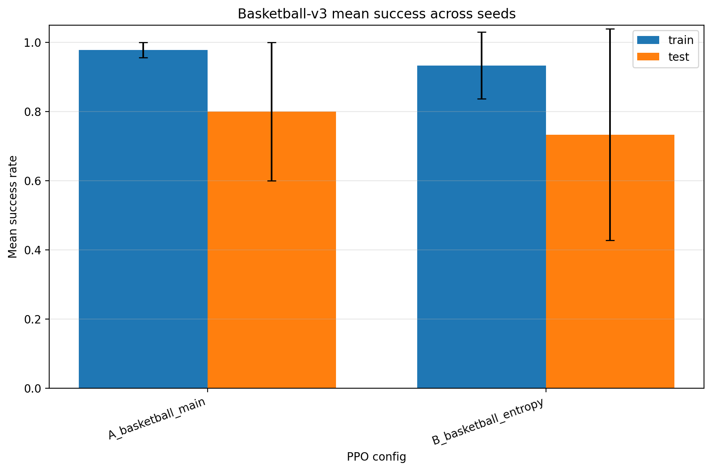

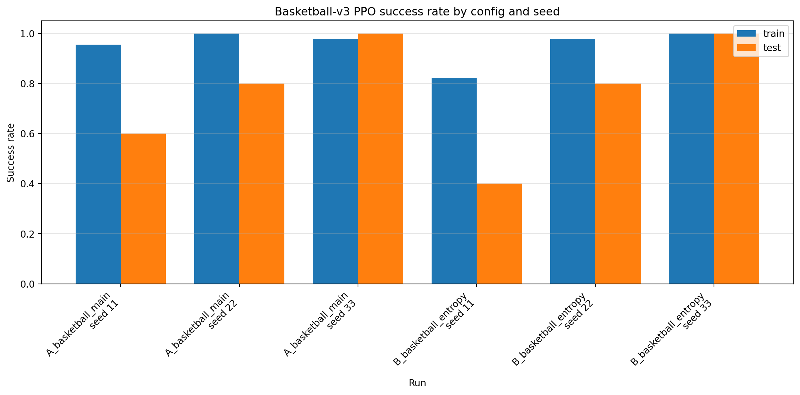


---

## 1.3 `push-v3`

Source CSV:

```text
single-task-mts/push_v3/push_v3_ppo_split_runs/results/push_v3_aggregate_results.csv
```

Πειραματική διάταξη:

- environment: `push-v3`
- total timesteps: `6,000,000`
- parallel envs: `4`
- train/test split: `45/5`
- split seeds: `67`, `68`, `75`
- train seed: `11`
- configs: `base_push`, `careful_push`, `short_rollout_push`
- `VecNormalize`: `True`

### Μέσοι όροι ανά config

| Config | Mean train success | Mean test success | Mean train return | Mean test return |
|---|---:|---:|---:|---:|
| `base_push` | 0.837 | 0.933 | 262.14 | 293.73 |
| `careful_push` | 0.985 | 1.000 | 174.92 | 158.05 |
| `short_rollout_push` | 0.474 | 0.533 | 470.77 | 172.29 |

### Test success ανά split

| Config | Split 0 | Split 1 | Split 2 |
|---|---:|---:|---:|
| `base_push` | 1.000 | 0.800 | 1.000 |
| `careful_push` | 1.000 | 1.000 | 1.000 |
| `short_rollout_push` | 0.800 | 0.400 | 0.400 |

### Σχήματα


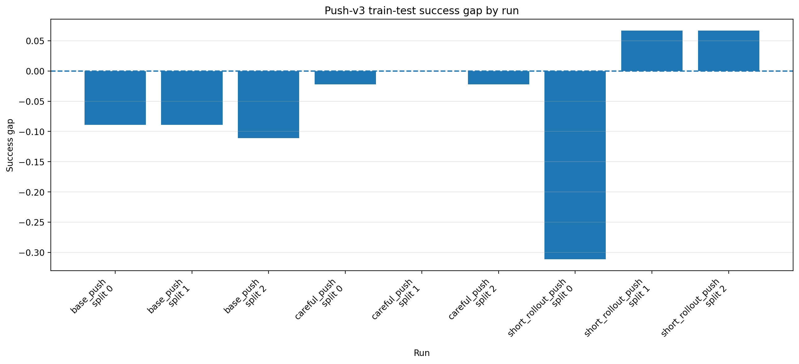

---

## 1.4 `pick-place-v3`

Source CSV:

```text
single-task-mts/pick-place/pick-place_v3_ppo_split_runs/results/pick-place_v3_aggregate_results.csv
```

Πειραματική διάταξη:

- environment: `pick-place-v3`
- total timesteps: `6,000,000`
- parallel envs: `4`
- train/test split: `45/5`
- split seeds: `67`, `68`, `75`
- train seed: `11`
- configs: `base_pick`, `careful_pick`, `short_rollout_pick`, `light_entropy_pick`
- `VecNormalize`: `True`

### Μέσοι όροι ανά config

| Config | Mean train success | Mean test success | Mean train return | Mean test return |
|---|---:|---:|---:|---:|
| `base_pick` | 0.837 | 0.733 | 72.08 | 51.57 |
| `careful_pick` | 0.993 | 0.933 | 58.69 | 59.14 |
| `short_rollout_pick` | 0.089 | 0.000 | 273.56 | 196.14 |
| `light_entropy_pick` | 0.956 | 1.000 | 47.33 | 66.08 |

### Test success ανά split

| Config | Split 0 | Split 1 | Split 2 |
|---|---:|---:|---:|
| `base_pick` | 0.800 | 0.400 | 1.000 |
| `careful_pick` | 1.000 | 0.800 | 1.000 |
| `short_rollout_pick` | 0.000 | 0.000 | 0.000 |
| `light_entropy_pick` | 1.000 | 1.000 | 1.000 |

### Σχήμα

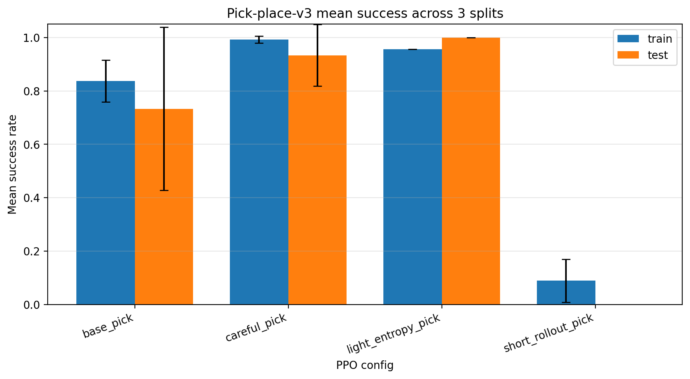

---

# 2. Custom multi-task πειράματα με task ID

Στα custom multi-task πειράματα, ένα κοινό PPO policy εκπαιδεύεται σε περισσότερα από ένα Meta-World tasks. Στο standard setting, η παρατήρηση επεκτείνεται με one-hot task ID, ώστε το policy να γνωρίζει ποιο task είναι ενεργό.

Για παράδειγμα, σε ένα pair δύο tasks:

```text
task 0 -> original observation + [1, 0]
task 1 -> original observation + [0, 1]
```

Στα 3-task και 4-task settings, το one-hot task ID επεκτείνεται αντίστοιχα σε μήκος 3 ή 4.

---

## 2.1 Custom MT: `button-press-v3` + `push-v3`

Source CSVs:

```text
custom-mt-pairs/custom_button_push/button_push_eval_results_100ep_3seeds/button_push_eval_summary.csv
custom-mt-pairs/custom_button_push/button_push_eval_results_100ep_3seeds/button_push_success_rate_pivot.csv
```

Πειραματική διάταξη:

- tasks: `button-press-v3`, `push-v3`
- configs: `base`, `careful`, `explore`
- evaluation episodes: `300` ανά task/config
- metrics: success rate, return, episode length, first success step

### Success rate pivot

| Config | `button-press-v3` | `push-v3` |
|---|---:|---:|
| `base` | 1.000 | 0.973 |
| `careful` | 1.000 | 0.980 |
| `explore` | 1.000 | 0.560 |

### Αναλυτική σύνοψη

| Config | Task | Success rate | Avg return | Avg episode length | Avg first success step | Episodes |
|---|---|---:|---:|---:|---:|---:|
| `base` | `button-press-v3` | 1.000 | 64.17 | 37.39 | 37.39 | 300 |
| `base` | `push-v3` | 0.973 | 159.32 | 50.66 | 38.35 | 300 |
| `careful` | `button-press-v3` | 1.000 | 58.88 | 37.39 | 37.39 | 300 |
| `careful` | `push-v3` | 0.980 | 207.75 | 47.53 | 38.30 | 300 |
| `explore` | `button-press-v3` | 1.000 | 75.03 | 37.92 | 37.92 | 300 |
| `explore` | `push-v3` | 0.560 | 1148.26 | 270.43 | 90.06 | 300 |

### Σχήματα

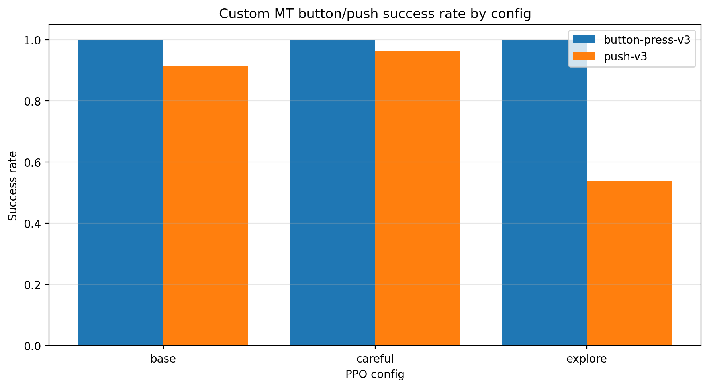


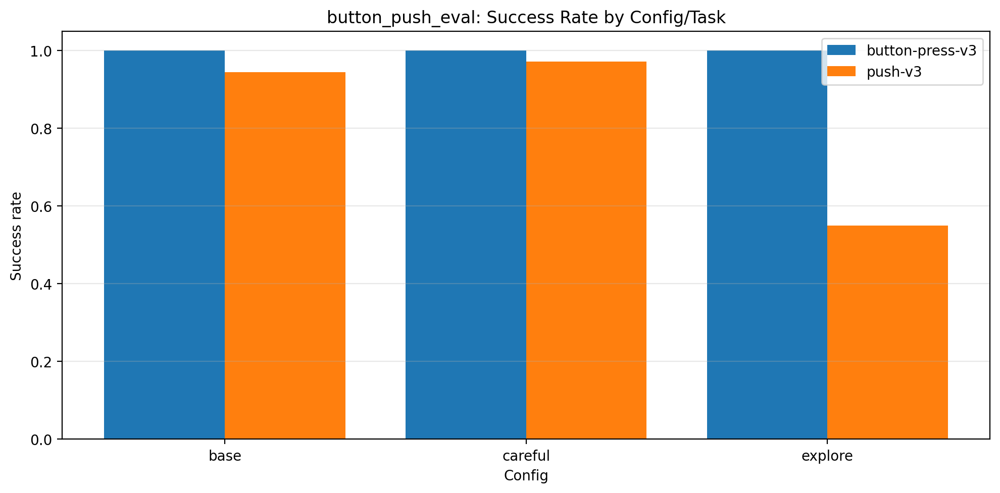

---

## 2.2 Custom MT: `basketball-v3` + `pick-place-v3`

Source CSVs:

```text
custom-mt-pairs/custom_basketball_pick_place/basketball_pickplace_eval_results/basketball_pickplace_eval_summary.csv
custom-mt-pairs/custom_basketball_pick_place/basketball_pickplace_eval_results/basketball_pickplace_success_rate_pivot.csv
```

Πειραματική διάταξη:

- tasks: `basketball-v3`, `pick-place-v3`
- configs: `base`, `careful`, `explore`
- evaluation episodes: `50` ανά task/config
- metrics: success rate, return, episode length, first success step

### Success rate pivot

| Config | `basketball-v3` | `pick-place-v3` |
|---|---:|---:|
| `base` | 0.960 | 1.000 |
| `careful` | 1.000 | 1.000 |
| `explore` | 0.900 | 1.000 |

### Αναλυτική σύνοψη

| Config | Task | Success rate | Avg return | Avg episode length | Avg first success step | Episodes |
|---|---|---:|---:|---:|---:|---:|
| `base` | `basketball-v3` | 0.960 | 3632.40 | 500.00 | 55.31 | 50 |
| `base` | `pick-place-v3` | 1.000 | 4554.93 | 500.00 | 49.88 | 50 |
| `careful` | `basketball-v3` | 1.000 | 4573.85 | 500.00 | 54.98 | 50 |
| `careful` | `pick-place-v3` | 1.000 | 4617.36 | 500.00 | 42.22 | 50 |
| `explore` | `basketball-v3` | 0.900 | 1787.81 | 500.00 | 68.11 | 50 |
| `explore` | `pick-place-v3` | 1.000 | 4125.38 | 500.00 | 42.10 | 50 |

### Σχήματα


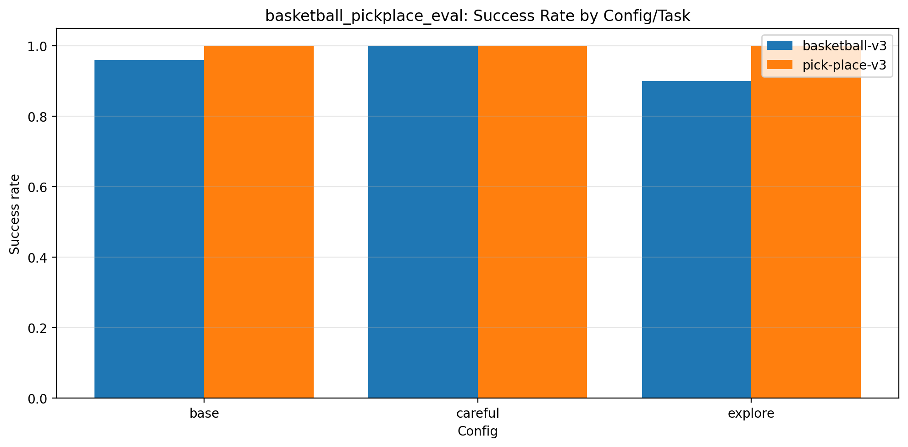

---

## 2.3 Custom MT: `push-v3` + `pick-place-v3`

Source CSVs:

```text
custom-mt-pairs/custom_push_pickplace/push_pickplace_eval_results/push_pickplace_summary.csv
custom-mt-pairs/custom_push_pickplace/push_pickplace_eval_results/push_pickplace_success_rate_pivot.csv
```

Πειραματική διάταξη:

- tasks: `push-v3`, `pick-place-v3`
- configs: `base`, `careful`, `explore`
- evaluation episodes: `300` ανά task/config
- metrics: success rate, return, episode length, first success step

### Success rate pivot

| Config | `pick-place-v3` | `push-v3` |
|---|---:|---:|
| `base` | 1.000 | 0.973 |
| `careful` | 1.000 | 1.000 |
| `explore` | 0.947 | 0.960 |

### Αναλυτική σύνοψη

| Config | Task | Success rate | Avg return | Avg episode length | Avg first success step | Episodes |
|---|---|---:|---:|---:|---:|---:|
| `base` | `pick-place-v3` | 1.000 | 61.43 | 40.11 | 40.11 | 300 |
| `base` | `push-v3` | 0.973 | 153.97 | 55.88 | 43.71 | 300 |
| `careful` | `pick-place-v3` | 1.000 | 57.83 | 42.44 | 42.44 | 300 |
| `careful` | `push-v3` | 1.000 | 128.82 | 35.91 | 35.91 | 300 |
| `explore` | `pick-place-v3` | 0.947 | 53.50 | 66.61 | 42.20 | 300 |
| `explore` | `push-v3` | 0.960 | 138.52 | 59.47 | 41.12 | 300 |

### Σχήματα


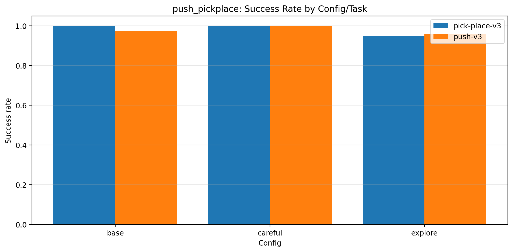

---

## 2.4 Custom MT: `basketball-v3` + `push-v3`

Το pair `basketball-v3 + push-v3` είναι σημαντικό γιατί δείχνει ότι το `basketball-v3` μπορεί να μαθευτεί σε two-task custom MT setting, παρότι αποτυγχάνει στα 3-task και 4-task settings.

### Success rate pivot

| Config | `basketball-v3` | `push-v3` |
|---|---:|---:|
| `base` | 0.953 | 1.000 |
| `careful` | 0.000 | 1.000 |
| `explore` | 0.000 | 0.953 |

### Ερμηνεία

Το `base` είναι το καλύτερο config για αυτό το pair. Λύνει και το `basketball-v3` και το `push-v3`. Αυτό δείχνει ότι η αποτυχία του `basketball-v3` στα μεγαλύτερα custom MT settings δεν οφείλεται στο ότι το task είναι αδύνατο, αλλά στο ότι η κοινή πολιτική δυσκολεύεται όταν αυξάνεται ο αριθμός ή η ετερογένεια των tasks.

---

# 3. Scaling experiments: 3-task και 4-task custom MT

## 3.1 `all3_no_basket`

Tasks:

```text
button-press-v3 + push-v3 + pick-place-v3
```

Source CSVs:

```text
custom-mt-3-envs/all3_no_basket_eval_results/all3_no_basket_summary.csv
custom-mt-3-envs/all3_no_basket_eval_results/all3_no_basket_success_rate_pivot.csv
```

### Success rate pivot

| Config | `button-press-v3` | `push-v3` | `pick-place-v3` |
|---|---:|---:|---:|
| `base` | 1.000 | 0.907 | 0.000 |
| `careful` | 1.000 | 0.993 | 0.000 |
| `explore` | 1.000 | 0.887 | 0.000 |

### Σχήμα

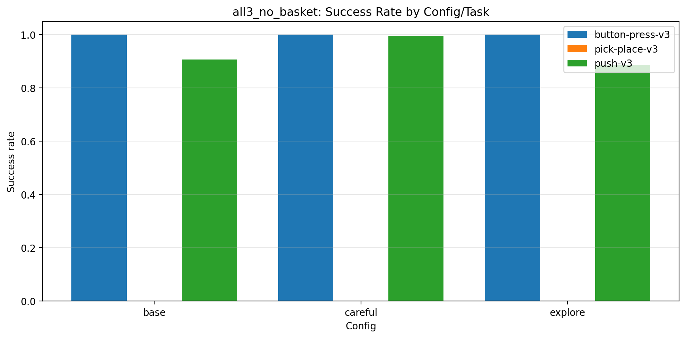

### Ερμηνεία

Η αφαίρεση του `basketball-v3` δεν αρκεί για να λυθεί το `pick-place-v3`. Το `button-press-v3` λύνεται πάντα, το `push-v3` λύνεται καλύτερα με `careful`, αλλά το `pick-place-v3` μένει στο 0.

---

## 3.2 `all3_no_pickplace`

Tasks:

```text
button-press-v3 + push-v3 + basketball-v3
```

Source CSVs:

```text
custom-mt-3-envs/all3_no_pickplace_eval_results/all3_no_pickplace_summary.csv
custom-mt-3-envs/all3_no_pickplace_eval_results/all3_no_pickplace_success_rate_pivot.csv
```

### Success rate pivot

| Config | `button-press-v3` | `push-v3` | `basketball-v3` |
|---|---:|---:|---:|
| `base` | 1.000 | 0.747 | 0.000 |
| `careful` | 1.000 | 1.000 | 0.000 |
| `explore` | 1.000 | 0.000 | 0.000 |

### Σχήμα

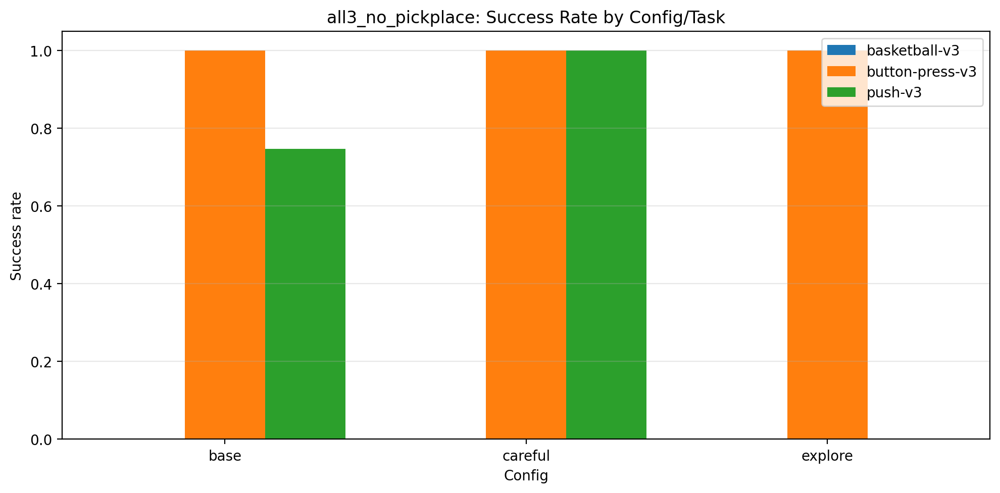

### Ερμηνεία

Η αφαίρεση του `pick-place-v3` δεν αρκεί για να λυθεί το `basketball-v3`. Το `careful` κρατάει το `button-press-v3` και το `push-v3` στο 1.000, αλλά το basketball παραμένει 0.

---

## 3.3 `all3_no_push`

Tasks:

```text
button-press-v3 + basketball-v3 + pick-place-v3
```

Source CSVs:

```text
custom-mt-3-envs/all3_no_push_eval_results/all3_no_push_summary.csv
custom-mt-3-envs/all3_no_push_eval_results/all3_no_push_success_rate_pivot.csv
```

### Success rate pivot

| Config | `button-press-v3` | `basketball-v3` | `pick-place-v3` |
|---|---:|---:|---:|
| `base` | 1.000 | 0.000 | 0.000 |
| `careful` | 1.000 | 0.000 | 0.000 |
| `explore` | 1.000 | 0.000 | 0.000 |

### Σχήμα

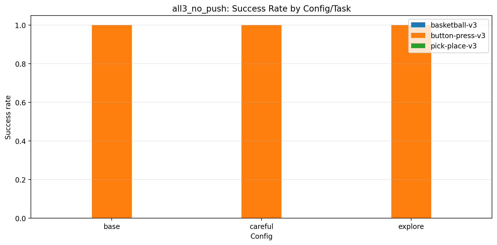

### Ερμηνεία

Η αφαίρεση του `push-v3` δεν βοηθά τα δύο δυσκολότερα tasks. Το policy λύνει μόνο το `button-press-v3`, ενώ τα `basketball-v3` και `pick-place-v3` παραμένουν στο 0.

---

## 3.4 `all4`

Tasks:

```text
button-press-v3 + push-v3 + pick-place-v3 + basketball-v3
```

Source CSVs:

```text
custom-mt-4-envs/all4_eval_results/all4_summary.csv
custom-mt-4-envs/all4_eval_results/all4_success_rate_pivot.csv
```

### Success rate pivot

| Config | `button-press-v3` | `push-v3` | `pick-place-v3` | `basketball-v3` |
|---|---:|---:|---:|---:|
| `base` | 1.000 | 0.660 | 0.000 | 0.000 |
| `careful` | 1.000 | 1.000 | 0.000 | 0.000 |
| `explore` | 1.000 | 0.940 | 0.013 | 0.000 |

### Ερμηνεία

Το 4-task setting δείχνει καθαρά το scaling πρόβλημα. Το shared PPO policy λύνει τα πιο εύκολα/contact-based tasks (`button-press-v3`, `push-v3`) αλλά αποτυγχάνει στα hard object-placement tasks (`pick-place-v3`, `basketball-v3`).

---

# 4. Task-ID ablation πειράματα

Στα παρακάτω πειράματα αφαιρείται το one-hot task ID από την παρατήρηση. Έτσι ελέγχεται αν το shared policy μπορεί να ξεχωρίσει το ενεργό task μόνο από την κατάσταση του περιβάλλοντος.

## 4.1 `button_push_noid`

Tasks:

```text
button-press-v3 + push-v3
```

Source CSVs:

```text
custom-mt-pairs-no-id/button_push_noid_eval_results/button_push_noid_summary.csv
custom-mt-pairs-no-id/button_push_noid_eval_results/button_push_noid_success_rate_pivot.csv
```

### Success rate pivot

| Config | `button-press-v3` | `push-v3` |
|---|---:|---:|
| `careful` | 1.000 | 0.027 |

### Σχήμα

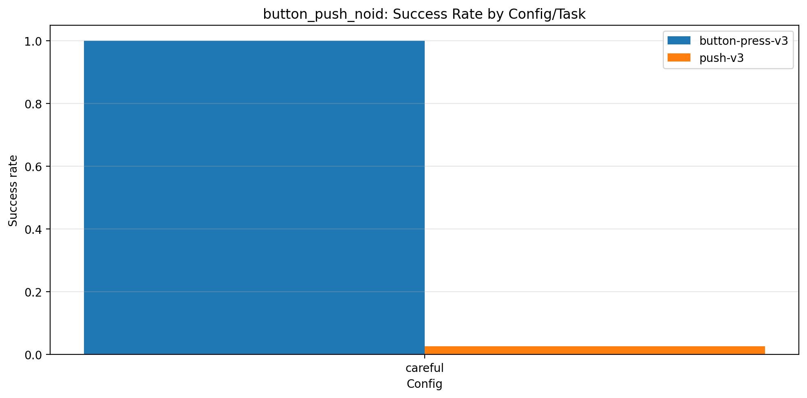

### Ερμηνεία

Χωρίς task ID, το policy λύνει το `button-press-v3`, αλλά σχεδόν χάνει τελείως το `push-v3`. Εδώ το task ID φαίνεται πολύ σημαντικό.

---

## 4.2 `push_pickplace_noid`

Tasks:

```text
push-v3 + pick-place-v3
```

Source CSVs:

```text
custom-mt-pairs-no-id/push_pickplace_noid_eval_results/push_pickplace_noid_summary.csv
custom-mt-pairs-no-id/push_pickplace_noid_eval_results/push_pickplace_noid_success_rate_pivot.csv
```

### Success rate pivot

| Config | `push-v3` | `pick-place-v3` |
|---|---:|---:|
| `careful` | 0.993 | 1.000 |

### Σχήμα

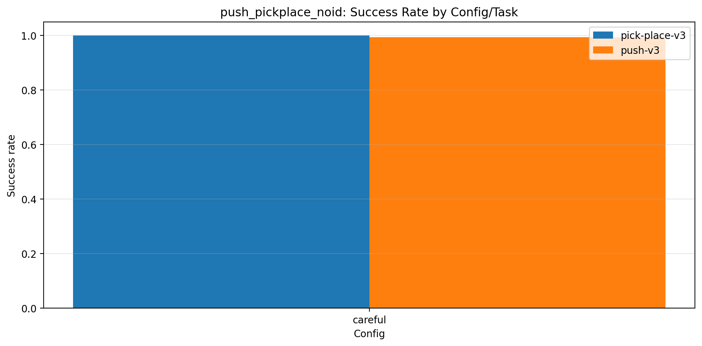

### Ερμηνεία

Το task ID δεν είναι απαραίτητο για αυτό το pair. Το policy μπορεί να ξεχωρίσει και να λύσει και τα δύο tasks χωρίς explicit task identity.

---

## 4.3 `basketball_push_noid`

Tasks:

```text
basketball-v3 + push-v3
```

Source CSVs:

```text
custom-mt-pairs-no-id/basketball_push_noid_eval_results/basketball_push_noid_summary.csv
custom-mt-pairs-no-id/basketball_push_noid_eval_results/basketball_push_noid_success_rate_pivot.csv
```

### Success rate pivot

| Config | `basketball-v3` | `push-v3` |
|---|---:|---:|
| `base` | 0.000 | 1.000 |

### Σχήμα

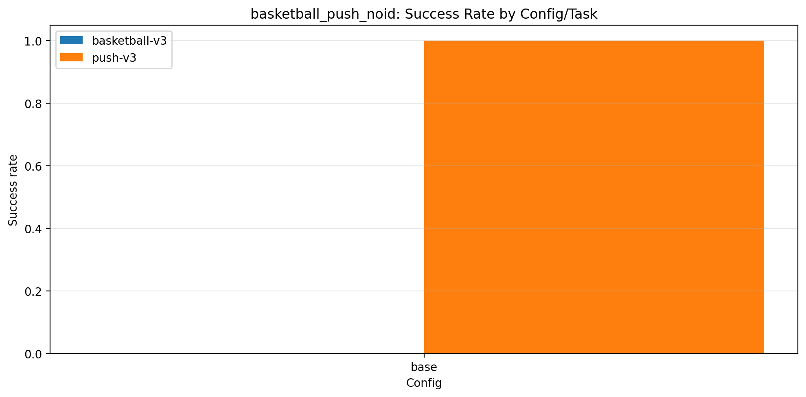

### Ερμηνεία

Το αποτέλεσμα είναι ιδιαίτερα σημαντικό. Με task ID, το `basketball_push` με `base` έφτασε `basketball-v3 = 0.953` και `push-v3 = 1.000`. Χωρίς task ID, το `basketball-v3` πέφτει στο 0, ενώ το `push-v3` παραμένει 1.000. Άρα για αυτό το pair, το task ID είναι κρίσιμο.

---

## 4.4 `basketball_pickplace_noid`

Tasks:

```text
basketball-v3 + pick-place-v3
```

Source CSVs:

```text
custom-mt-pairs-no-id/basketball_pickplace_noid_eval_results/basketball_pickplace_noid_summary.csv
custom-mt-pairs-no-id/basketball_pickplace_noid_eval_results/basketball_pickplace_noid_success_rate_pivot.csv
```

### Success rate pivot

| Config | `basketball-v3` | `pick-place-v3` |
|---|---:|---:|
| `careful` | 1.000 | 1.000 |

### Σχήμα

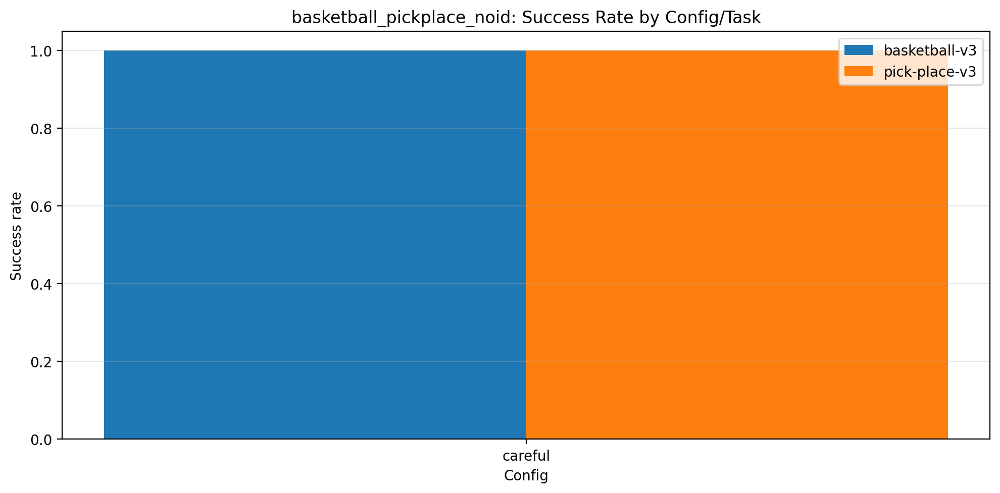

### Ερμηνεία

Το task ID δεν είναι καθολικά απαραίτητο. Σε αυτό το pair, ακόμα και χωρίς explicit task identity, το policy λύνει και τα δύο tasks τέλεια.

---

# 5. Συγκεντρωτικοί πίνακες

## 5.1 Single-task αποτελέσματα

| Environment | Config | Test success |
|---|---|---:|
| `basketball-v3` | `A_basketball_main` | 0.800 |
| `basketball-v3` | `B_basketball_entropy` | 0.733 |
| `basketball-v3` | `careful_basketball` | 1.000 |
| `push-v3` | `base_push` | 0.933 |
| `push-v3` | `careful_push` | 1.000 |
| `push-v3` | `short_rollout_push` | 0.533 |
| `pick-place-v3` | `base_pick` | 0.733 |
| `pick-place-v3` | `careful_pick` | 0.933 |
| `pick-place-v3` | `short_rollout_pick` | 0.000 |
| `pick-place-v3` | `light_entropy_pick` | 1.000 |

## 5.2 Two-task custom multi-task αποτελέσματα με task ID

| Custom MT | Config | Task 1 success | Task 2 success |
|---|---|---:|---:|
| `button-press-v3` + `push-v3` | `base` | 1.000 | 0.973 |
| `button-press-v3` + `push-v3` | `careful` | 1.000 | 0.980 |
| `button-press-v3` + `push-v3` | `explore` | 1.000 | 0.560 |
| `basketball-v3` + `pick-place-v3` | `base` | 0.960 | 1.000 |
| `basketball-v3` + `pick-place-v3` | `careful` | 1.000 | 1.000 |
| `basketball-v3` + `pick-place-v3` | `explore` | 0.900 | 1.000 |
| `push-v3` + `pick-place-v3` | `base` | 0.973 | 1.000 |
| `push-v3` + `pick-place-v3` | `careful` | 1.000 | 1.000 |
| `push-v3` + `pick-place-v3` | `explore` | 0.960 | 0.947 |
| `basketball-v3` + `push-v3` | `base` | 0.953 | 1.000 |
| `basketball-v3` + `push-v3` | `careful` | 0.000 | 1.000 |
| `basketball-v3` + `push-v3` | `explore` | 0.000 | 0.953 |

## 5.3 Scaling αποτελέσματα

| Experiment | Config | Εύκολα/contact tasks | Hard object-placement tasks |
|---|---|---|---|
| `all3_no_basket` | `careful` | button 1.000, push 0.993 | pick-place 0.000 |
| `all3_no_pickplace` | `careful` | button 1.000, push 1.000 | basketball 0.000 |
| `all3_no_push` | `careful` | button 1.000 | basketball 0.000, pick-place 0.000 |
| `all4` | `careful` | button 1.000, push 1.000 | basketball 0.000, pick-place 0.000 |

## 5.4 Task-ID ablation αποτελέσματα

| No-ID Custom MT | Config | Task 1 success | Task 2 success |
|---|---|---:|---:|
| `button-press-v3` + `push-v3` | `careful` | 1.000 | 0.027 |
| `push-v3` + `pick-place-v3` | `careful` | 0.993 | 1.000 |
| `basketball-v3` + `push-v3` | `base` | 0.000 | 1.000 |
| `basketball-v3` + `pick-place-v3` | `careful` | 1.000 | 1.000 |

---

# 6. PPO configuration details

## 6.1 Γενικές ρυθμίσεις εκπαίδευσης

| Παράμετρος | Τιμή / Περιγραφή |
|---|---|
| Αλγόριθμος | PPO |
| Policy | `MlpPolicy` |
| Περιβάλλοντα | Meta-World MT1 tasks |
| Reward function | `v2` |
| Μέγιστο μήκος επεισοδίου | `500` steps |
| Vectorized environments | `SubprocVecEnv` |
| Καταγραφή επεισοδίων | `VecMonitor` |
| Κανονικοποίηση | `VecNormalize`, όπου χρησιμοποιείται |
| TensorBoard | Χρησιμοποιείται για logging των training runs |
| Checkpoints | Αποθηκεύονται ανά συγκεκριμένο αριθμό timesteps |

## 6.2 Single-task template configs

Οι single-task πειραματικές ομάδες `button-press-v3`, `push-v3` και `pick-place-v3` χρησιμοποιούν παρόμοια δομή PPO configurations. Τα ονόματα των configs διαφέρουν ανά task, π.χ. `base_push`, `base_pick`, `base_button`, αλλά οι βασικές ρυθμίσεις ακολουθούν την ίδια λογική.

| Config family | Learning rate | `n_steps` | Rollout size με 4 envs | Batch size | Epochs | `gamma` | `gae_lambda` | `clip_range` | `ent_coef` | `vf_coef` | `max_grad_norm` |
|---|---:|---:|---:|---:|---:|---:|---:|---:|---:|---:|---:|
| `base_*` | `3e-4` | `1024` | `4096` | `256` | `10` | `0.99` | `0.95` | `0.20` | `0.0` | `0.5` | `0.5` |
| `careful_*` | `1e-4` | `1024` | `4096` | `512` | `15` | `0.995` | `0.95` | `0.15` | `0.0` | `0.7` | `0.5` |
| `short_rollout_*` | `3e-4` | `512` | `2048` | `256` | `10` | `0.99` | `0.95` | `0.20` | `0.0` | `0.5` | `0.5` |
| `light_entropy_*` | `2.5e-4` | `1024` | `4096` | `256` | `10` | `0.99` | `0.95` | `0.20` | `0.002` | `0.5` | `0.5` |

Στα single-task scripts χρησιμοποιούνται 4 parallel workers (`n_envs=4`) και, για τα split-based πειράματα, τρία 45/5 train/test splits με 50 συνολικά task variations ανά περιβάλλον.

## 6.3 Basketball single-task configs

Το `basketball-v3` χρησιμοποιεί ειδικές PPO configurations, επειδή ήταν πιο απαιτητικό task από τα απλούστερα contact-based tasks.

### Αρχικά basketball configs

| Config | Learning rate | `n_steps` | Rollout size με 4 envs | Batch size | Epochs | `gamma` | `gae_lambda` | `clip_range` | `ent_coef` | `vf_coef` | `max_grad_norm` |
|---|---:|---:|---:|---:|---:|---:|---:|---:|---:|---:|---:|
| `A_basketball_main` | `3e-4` | `8192` | `32768` | `512` | `20` | `0.995` | `0.95` | `0.20` | `0.0` | `0.5` | `1.0` |
| `B_basketball_entropy` | `3e-4` | `8192` | `32768` | `512` | `20` | `0.995` | `0.95` | `0.20` | `0.001` | `0.5` | `1.0` |

### Νεότερα basketball split configs

| Config | Learning rate | `n_steps` | Rollout size με 4 envs | Batch size | Epochs | `gamma` | `gae_lambda` | `clip_range` | `ent_coef` | `vf_coef` | `max_grad_norm` | Network |
|---|---:|---:|---:|---:|---:|---:|---:|---:|---:|---:|---:|---|
| `base_basketball` | `3e-4` | `8192` | `32768` | `512` | `20` | `0.995` | `0.95` | `0.20` | `0.0` | `0.5` | `1.0` | `(256, 256)` |
| `careful_basketball` | `1e-4` | `8192` | `32768` | `512` | `20` | `0.995` | `0.95` | `0.15` | `0.0` | `0.7` | `0.7` | `(256, 256)` |
| `short_rollout_basketball` | `3e-4` | `4096` | `16384` | `512` | `20` | `0.995` | `0.95` | `0.20` | `0.0` | `0.5` | `1.0` | `(256, 256)` |
| `light_entropy_basketball` | `3e-4` | `8192` | `32768` | `512` | `20` | `0.995` | `0.95` | `0.20` | `0.001` | `0.5` | `1.0` | `(256, 256)` |

## 6.4 Custom multi-task configs

Τα custom multi-task πειράματα χρησιμοποιούν τρεις κοινές PPO configurations: `base`, `careful` και `explore`.

Στα standard custom MT πειράματα, κάθε episode επιλέγει ένα ενεργό task και προσθέτει one-hot task ID στην παρατήρηση. Στα no-task-ID ablations, αυτό το one-hot vector αφαιρείται.

| Config | Learning rate | `n_steps` | Rollout size με 8 envs | Batch size | Epochs | `gamma` | `gae_lambda` | `clip_range` | `ent_coef` | `vf_coef` | `max_grad_norm` | Network architecture |
|---|---:|---:|---:|---:|---:|---:|---:|---:|---:|---:|---:|---|
| `base` | `1e-4` | `2048` | `16384` | `1024` | `10` | `0.99` | `0.95` | `0.15` | `0.005` | `0.7` | `0.5` | `(256, 256)` |
| `careful` | `3e-5` | `2048` | `16384` | `1024` | `15` | `0.99` | `0.95` | `0.10` | `0.002` | `0.8` | `0.3` | `(256, 256)` |
| `explore` | `2e-4` | `2048` | `16384` | `1024` | `10` | `0.99` | `0.95` | `0.20` | `0.01` | `0.5` | `0.5` | `(256, 256)` |

Οι custom multi-task εκπαιδεύσεις χρησιμοποιούν συνήθως `8` parallel environments. Τα 2-task experiments εκπαιδεύονται με budget περίπου `10,000,000` timesteps. Τα 3-task experiments χρησιμοποιούν περίπου `15,000,000` timesteps, ώστε να αντιστοιχούν περίπου σε `5M` timesteps ανά task. Το 4-task setting χρησιμοποιεί περίπου `20,000,000` timesteps, για αντίστοιχο budget περίπου `5M` ανά task.

Στα training scripts αποθηκεύονται τόσο το τελικό PPO μοντέλο όσο και τα στατιστικά του `VecNormalize`, ώστε η αξιολόγηση να μπορεί να γίνει με τα ίδια normalization statistics.

## 6.5 Config names ανά πείραμα

| Πείραμα | Config names |
|---|---|
| `button-press-v3` | `base_button`, `careful_button`, `short_rollout_button`, `light_entropy_button` |
| `basketball-v3` | `A_basketball_main`, `B_basketball_entropy`, `base_basketball`, `careful_basketball`, `short_rollout_basketball`, `light_entropy_basketball` |
| `push-v3` | `base_push`, `careful_push`, `short_rollout_push`, `light_entropy_push` |
| `pick-place-v3` | `base_pick`, `careful_pick`, `short_rollout_pick`, `light_entropy_pick` |
| Custom `button-press-v3` + `push-v3` | `base`, `careful`, `explore` |
| Custom `basketball-v3` + `pick-place-v3` | `base`, `careful`, `explore` |
| Custom `push-v3` + `pick-place-v3` | `base`, `careful`, `explore` |
| Custom `basketball-v3` + `push-v3` | `base`, `careful`, `explore` |
| Custom 3-task / 4-task | `base`, `careful`, `explore` |
| No-task-ID ablations | `base` ή `careful`, ανάλογα με το pair |

---

# 7. Κεντρικά συμπεράσματα

1. Τα single-task PPO baselines δείχνουν ότι τα tasks μπορούν να λυθούν όταν εκπαιδεύονται ξεχωριστά.
2. Τα 2-task custom MT settings μπορούν να λυθούν από ένα κοινό shared PPO policy, ειδικά με κατάλληλο PPO configuration.
3. Το `basketball-v3` δεν είναι αδύνατο task: λύνεται σε single-task setting και στο `basketball-v3 + push-v3` pair με `base`.
4. Η μετάβαση σε 3-task και 4-task settings δημιουργεί καθαρό scaling πρόβλημα.
5. Το shared PPO policy μαθαίνει σταθερά το `button-press-v3` και συχνά το `push-v3`, αλλά αποτυγχάνει στα `basketball-v3` και `pick-place-v3` όταν αυξάνεται ο αριθμός ή η ετερογένεια των tasks.
6. Το `explore` δεν λύνει απαραίτητα τα hard tasks και σε ορισμένες περιπτώσεις μειώνει τη σταθερότητα.
7. Το one-hot task ID είναι σημαντικό σε ορισμένα task pairs, αλλά όχι καθολικά απαραίτητο.
8. Το βασικό bottleneck φαίνεται να είναι το shared-policy multi-task optimization και το task interference, όχι η αδυναμία των individual tasks.


